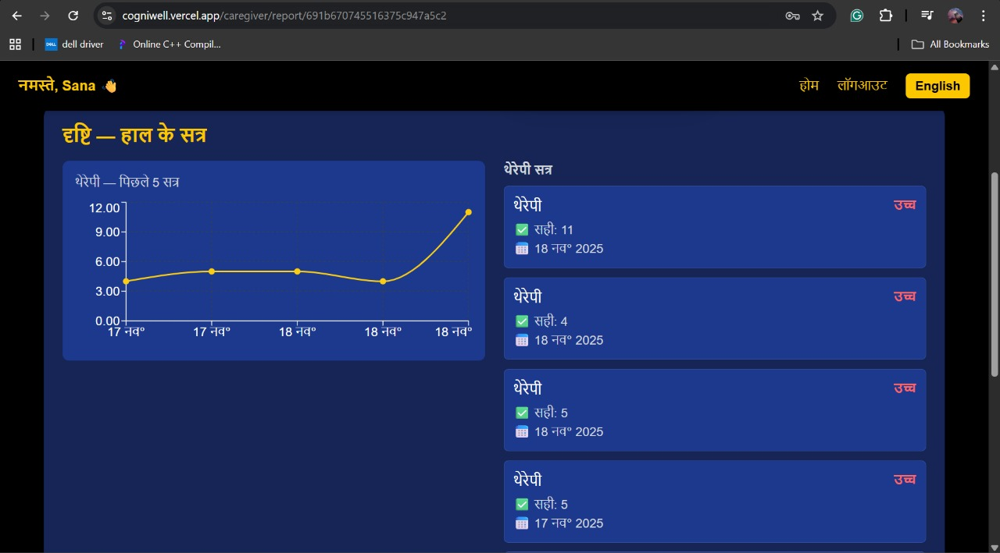
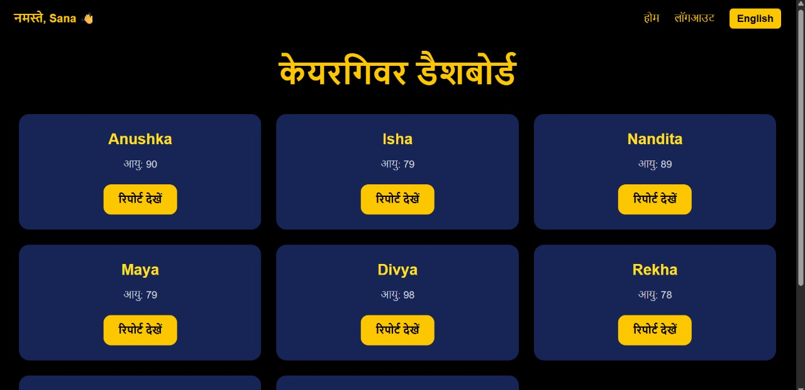
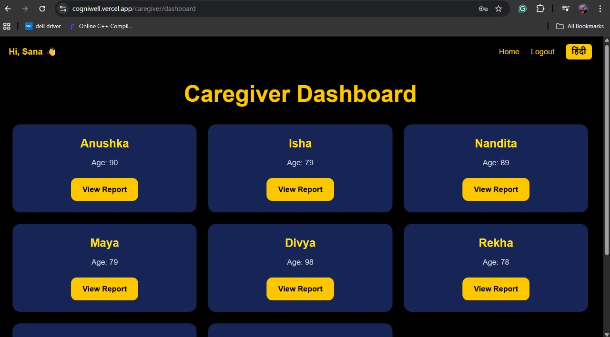
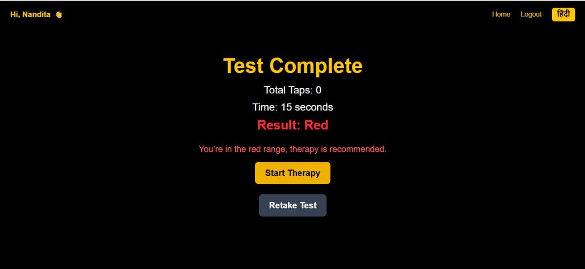
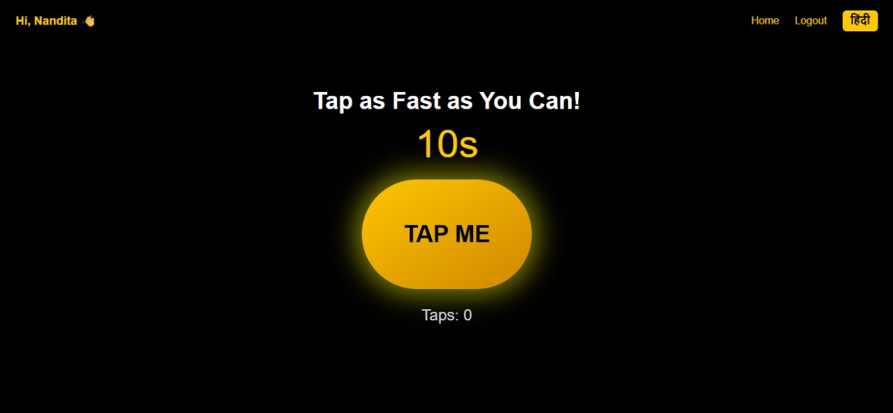
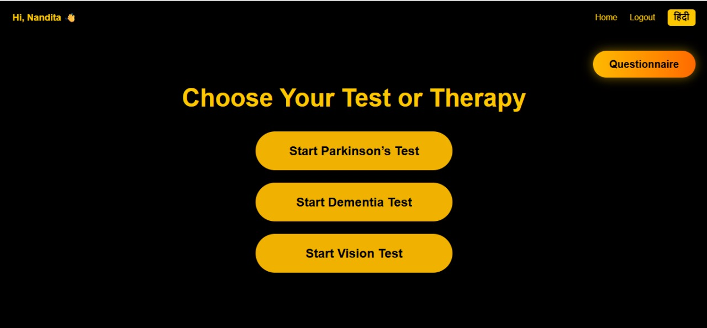
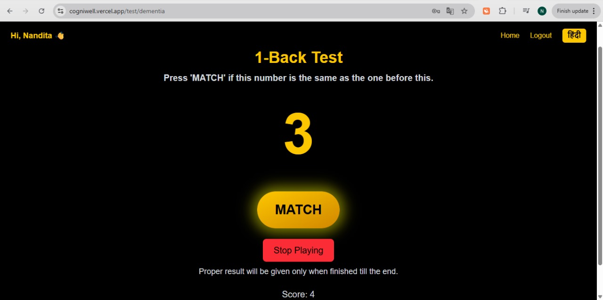
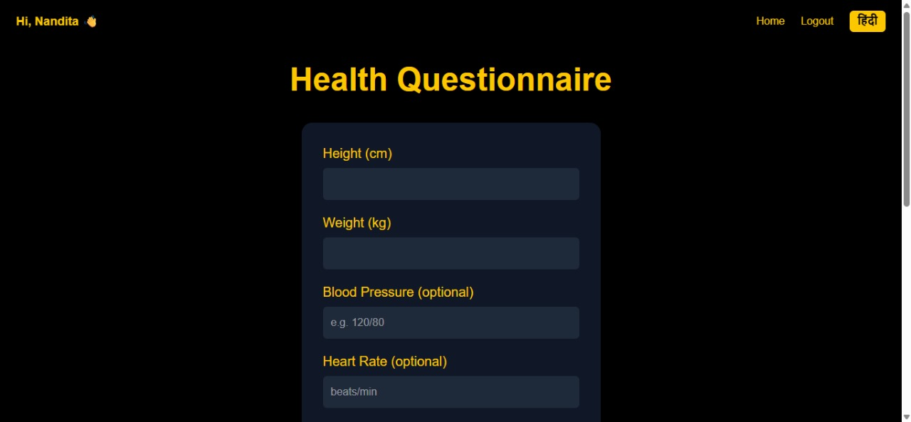

# CogniWell

> A full-stack health screening and therapy platform that lets elderly users self-test for early signs of Parkinson's, dementia, and vision decline through interactive games, and gives their caregivers a dashboard to track results over time.


**[Live Demo →](https://cogni-well.vercel.app/)**

---

## Table of Contents

- [Demo](#demo)
- [Screenshots](#screenshots)
- [Overview](#overview)
- [Problem Statement](#problem-statement)
- [Objectives](#objectives)
- [Key Features](#key-features)
- [Tech Stack](#tech-stack)
- [System Architecture](#system-architecture)
- [Project Structure](#project-structure)
- [How the System Works](#how-the-system-works)
- [Core Technical Implementation](#core-technical-implementation)
- [Database Design](#database-design)
- [API Documentation](#api-documentation)
- [Authentication & Authorization](#authentication--authorization)
- [Installation & Setup](#installation--setup)
- [Usage](#usage)
- [Testing](#testing)
- [Security](#security)
- [Challenges & Solutions](#challenges--solutions)
- [Design Decisions & Trade-offs](#design-decisions--trade-offs)
- [Limitations](#limitations)
- [Future Improvements](#future-improvements)
- [Deployment](#deployment)
- [My Contributions](#my-contributions)
- [Key Learnings](#key-learnings)
- [License](#license)

---

## Demo

🔗 **Live app:** [cogni-well.vercel.app](https://cogni-well.vercel.app/)

## Screenshots

### Test Selection
Elder home screen after login — pick a screening test or open the health questionnaire.



### Parkinson's Test (tap-rate screening)
A 10–15 second tap-as-fast-as-you-can task, with a live tap counter and a Red/Yellow/Green result at the end.




### Dementia Test ("1-Back" digit recall)
The user presses **MATCH** whenever the current number matches the one shown immediately before it, with a running score.


### Therapy Mode
Reached from a test result — a non-scored practice session, ending with total time taken.



### Health Questionnaire
Captures height, weight, blood pressure, heart rate, and other vitals used for BMI calculation.



### Caregiver Dashboard
Lists every elder linked to the caregiver's account, each with a **View Report** link. Fully bilingual (English/Hindi).




### Caregiver Report
Per-elder session history with a trend chart across recent sessions plus a scrollable list of individual sessions.



## Overview

CogniWell is a two-sided web application built for elderly users ("elders") and their caregivers. Elders complete short, game-based screening tests for **Parkinson's disease** (finger-tapping speed), **dementia** (digit-sequence memory recall), and **vision decline** (shape-matching), and can follow up with a corresponding **therapy/exercise mode** for each condition. Caregivers register separately, get linked to the elders in their care, and can view each elder's test history and session metrics from a dashboard.

## Problem Statement

Early signs of neurodegenerative and sensory decline in elderly people are often missed because formal clinical screening is infrequent, and family caregivers rarely have an easy way to track cognitive/motor health between visits. CogniWell addresses this by turning clinically-inspired screening tasks (tapping speed, sequence memory, shape recognition) into short, repeatable, game-like tests that elders can take on their own, with results automatically shared with a linked caregiver.

## Objectives

- Let an elder self-administer short screening tests for three conditions without supervision.
- Score each test session against defined thresholds and store the result for longitudinal tracking.
- Give caregivers a read-only, authenticated view of the elders linked to their account and their session history.
- Offer a therapy/practice mode per condition, separate from the scored test.
- Support bilingual (English/Hindi) UI for accessibility.

## Key Features

- **Three independent screening tests**: Parkinson's (tap-rate test), Dementia (a "1-Back" digit-recall test, matching the current number against the one shown before it, across three difficulty levels), Vision (timed shape-matching test).
- **Paired therapy mode** for each condition, reachable after finishing a test.
- **Dual authentication system**: separate signup/login flows and JWT cookies for elders (`User`) and caregivers (`Caregiver`).
- **Caregiver–elder linking**, by email, at elder signup time (works even if the caregiver registers afterward).
- **Caregiver dashboard** listing linked elders and their game-session history.
- **Health questionnaire** capturing vitals (height, weight, blood pressure, heart rate, sleep, stress) with automatic BMI calculation.
- **Session recording API** that stores per-test metrics (taps/sec, correct answers, grid size, time) to MongoDB.
- **Bilingual UI** (English/Hindi toggle) persisted in local storage.
- **Persistent client-side session caching** so a logged-in user isn't shown a loader on every page load.

## Tech Stack

| Category | Technology | Purpose |
|---|---|---|
| Frontend | React 19 (Vite) | Single-page application UI |
| Routing | React Router v7 | Client-side routing |
| Styling | Tailwind CSS 4 | Utility-first styling |
| HTTP Client | Axios | API communication with cookies |
| Charts | Recharts | Visualizing session/report data |
| State | React Context API | Global auth/session state |
| Backend | Node.js + Express 5 | REST API server |
| Database | MongoDB + Mongoose | Data persistence and schema modeling |
| Authentication | JWT + bcryptjs | Stateless auth, password hashing |
| File/Media | Multer + Cloudinary | Present in dependencies for file/image handling |
| Dev Tooling | Nodemon, ESLint | Auto-reload backend, frontend linting |

## System Architecture

```
                    ┌─────────────────────────┐
                    │        Client            │
                    │  React SPA (Vite)         │
                    │  Elder UI  |  Caregiver UI │
                    └────────────┬─────────────┘
                                 │ Axios (withCredentials)
                                 ▼
                    ┌─────────────────────────┐
                    │      Express Server       │
                    │        (server.js)        │
                    └────────────┬─────────────┘
                                 │
             ┌───────────────────┼───────────────────┐
             ▼                   ▼                   ▼
     ┌───────────────┐  ┌────────────────┐  ┌──────────────────┐
     │ authUser /     │  │  Route Layer    │  │  Controller Layer │
     │ authCaregiver  │  │ (user, caregiver,│  │ (business logic)  │
     │ (JWT middleware)│  │ game-session,    │  │                   │
     └───────────────┘  │ questionnaire)    │  └─────────┬─────────┘
                          └────────────────┘             │
                                                          ▼
                                                ┌──────────────────┐
                                                │  Mongoose Models  │
                                                │ User / Caregiver /│
                                                │ GameSession /     │
                                                │ Questionnaire     │
                                                └────────┬──────────┘
                                                          ▼
                                                ┌──────────────────┐
                                                │     MongoDB       │
                                                └──────────────────┘
```

### Architecture Flow

1. The React client sends requests to the Express API with credentials (cookies) attached.
2. Two separate JWT-based middlewares (`authUser`, `authCaregiver`) protect elder-only and caregiver-only routes respectively, reading their own signed cookie (`token` vs `caregiver_token`).
3. Route files map HTTP endpoints to controller functions per domain (user, caregiver, game session, questionnaire, results).
4. Controllers contain the business logic — registration/linking, login, score recording, and data retrieval — and talk to Mongoose models.
5. MongoDB stores users, caregivers, game sessions, and questionnaires, with references (`ObjectId`) linking elders to caregivers and sessions to elders.
6. JSON responses flow back to the client, which updates UI state via the shared `AppContext`.

## Project Structure

```
cw01/
├── client/                     # React frontend (Vite)
│   └── src/
│       ├── components/         # Navbar, FullScreenLoader
│       ├── context/             # AppContext.jsx – global auth/session state
│       ├── pages/                # Route-level pages (see below)
│       └── utils/                # language.js, storage.js
│
├── server/                     # Express backend
│   ├── configs/db.js            # MongoDB connection
│   ├── controllers/             # Request handlers per domain
│   ├── middlewares/              # authUser.js, authCaregiver.js
│   ├── models/                   # Mongoose schemas
│   ├── routes/                   # Express routers
│   └── server.js                 # App entry point
│
└── README.md
```

### Directory Responsibilities

- `controllers/` — Registration, login, logout, session recording, and dashboard data logic.
- `middlewares/` — Verifies JWT cookies and attaches `req.userId` / `req.caregiverId`.
- `models/` — `User`, `Caregiver`, `GameSession`, `Questionnaire` Mongoose schemas.
- `routes/` — Maps `/api/user`, `/api/caregiver`, `/api/game-session`, `/api/questionnaire` to controllers.
- `client/src/pages/` — One page per screen: `LandingPage`, `Signup`, `Login`, `TestSelection`, `TestRouter`, `ParkinsonsTest`, `DementiaTest`, `VisionTest`, `TherapyPage` (+ per-condition therapy pages), `Questionnaire`, `CaregiverLogin`, `CaregiverDashboard`, `UserReport`.

## How the System Works

### Elder flow
1. **Sign up** as an elder with name, email, password, age, gender, and optional caregiver email.
2. **Log in**, receive a `token` cookie, and land on the test selection screen.
3. **Choose a condition** (Parkinson's / Dementia / Vision) — `TestRouter` renders the correct test component for the URL parameter.
4. **Take the test**: e.g. tap as fast as possible for 15 seconds (Parkinson's), recall an on-screen digit sequence across three difficulty levels (Dementia), or match shapes under time pressure (Vision).
5. On completion, the result is classified against fixed thresholds (e.g. Green/Yellow/Red for tap rate) and can be sent to the backend via `POST /api/game-session/record`.
6. The user may continue into the matching **therapy mode**, a non-scored practice version of the same interaction.

### Caregiver flow
1. **Register/log in** separately at `/caregiver/login`, receiving a `caregiver_token` cookie.
2. At registration, any elders who had already listed this caregiver's email are automatically linked.
3. On the **dashboard**, the caregiver fetches their linked elders (`GET /api/caregiver/elders`) and, per elder, the full session history (`GET /api/caregiver/elder/:elderId/sessions`) — with an authorization check confirming the elder is actually linked to that caregiver.

## Core Technical Implementation

### Screening logic
- **Parkinson's test**: counts taps in a fixed 15-second window and classifies the result into `Green` (≥35 taps), `Yellow` (≥27 taps), or `Red` (below that) as a proxy for motor speed/dexterity — a result of `Red` prompts the user to start the matching therapy mode.
- **Dementia test**: a "1-Back" recall task that presents a timed digit sequence (15 digits) across three increasing difficulty levels; the user presses **MATCH** whenever the current digit equals the one immediately before it, and each level has its own passing accuracy threshold with per-level score, attempts, and accuracy tracked.
- **Vision test**: a randomized, shuffled shape-matching task rendered as SVG shapes, scored on correct answers and completion time.

### BMI auto-calculation
The `Questionnaire` model computes BMI and a status label (`Underweight` / `Normal` / `Overweight`) automatically in a Mongoose `pre("save")` hook whenever height and weight are provided, keeping that logic out of the controller.

### Caregiver–elder linking
Linking is done by email rather than ID, so an elder can name a caregiver before that caregiver even has an account. Both `User.register` (linking forward) and `Caregiver.register` (linking backward, for elders that signed up first) handle this two-directional case.

### Dual, isolated authentication
Elder and caregiver auth are fully separate: different Mongoose models, different JWT cookies (`token` vs `caregiver_token`), and different middlewares — so a caregiver token can never authorize elder-only routes and vice versa.

## Database Design

```
User
 ├── _id
 ├── name, email (unique), password (hashed)
 ├── age, gender
 ├── d1, d2, d3            # boolean flags: parkinsons / dementia / vision opted-in
 ├── caregiver              # ObjectId → Caregiver
 └── caregiverEmail

Caregiver
 ├── _id
 ├── name, email (unique), password (hashed), phone
 └── elders[]               # ObjectId[] → User

GameSession
 ├── _id
 ├── user                   # ObjectId → User
 ├── diseaseType             # "parkinson" | "dementia" | "vision"
 ├── mode                    # "detection" | "therapy"
 ├── score, result, duration
 └── metrics.{parkinson|dementia|vision}   # condition-specific fields

Questionnaire
 ├── _id
 ├── user                   # ObjectId → User
 ├── caregiver               # ObjectId → Caregiver
 ├── height, weight, bloodPressure, heartRate, breathsPerMin
 ├── physicalActivity, sleepHours, stressLevel
 └── bmi, bmiStatus          # auto-computed
```

**Design notes:**
- `User` and `Caregiver` reference each other bidirectionally (`caregiver` on `User`, `elders[]` on `Caregiver`) to support fast lookups from either side.
- A `post("findOneAndDelete")` hook on `User` cleans up the caregiver's `elders` array and the user's `GameSession` records when an elder is deleted, preventing orphaned references.
- `GameSession.metrics` is nested per disease type instead of a flat structure, keeping condition-specific fields (e.g. `tapsPerSecond` vs `gridSize`) isolated without needing separate collections.

## API Documentation

| Method | Endpoint | Description | Auth |
|---|---|---|---|
| POST | `/api/user/register` | Register an elder | No |
| POST | `/api/user/login` | Elder login | No |
| GET | `/api/user/is-auth` | Check elder session | Yes (user) |
| GET | `/api/user/logout` | Elder logout | Yes (user) |
| PUT | `/api/user/update-disease-status` | Update d1/d2/d3 flags | Yes (user) |
| POST | `/api/caregiver/register` | Register a caregiver | No |
| POST | `/api/caregiver/login` | Caregiver login | No |
| GET | `/api/caregiver/is-auth` | Check caregiver session | Yes (caregiver) |
| GET | `/api/caregiver/logout` | Caregiver logout | Yes (caregiver) |
| GET | `/api/caregiver/elders` | List elders linked to caregiver | Yes (caregiver) |
| GET | `/api/caregiver/elder/:elderId/sessions` | Get one elder's session history | Yes (caregiver) |
| POST | `/api/game-session/record` | Record a test/therapy session | Yes (user) |
| POST | `/api/questionnaire` | Submit a health questionnaire | No* |
| GET | `/api/questionnaire/user/:userId` | Get a user's questionnaires | No* |
| GET | `/api/questionnaire/:id` | Get a single questionnaire | No* |

\* Questionnaire routes currently rely on `userId` passed in the request rather than a dedicated auth middleware — see [Limitations](#limitations).

## Authentication & Authorization

- Passwords are hashed with **bcryptjs** before being stored; plaintext passwords are never persisted.
- Sessions are stateless **JWTs**, signed with a server-side secret and set as `httpOnly` cookies (`token` for elders, `caregiver_token` for caregivers) so they aren't accessible to client-side JavaScript.
- Cookie flags adapt to environment: `secure` and `sameSite: "none"` in production, relaxed for local development.
- Route-level authorization is enforced via `authUser` / `authCaregiver` middleware that decodes the JWT and attaches `req.userId` / `req.caregiverId` before the controller runs.
- Caregiver access to elder data is additionally checked at the data layer — `getElderSessions` verifies the requested `elderId` is actually present in that caregiver's `elders` array before returning any session data.

## Installation & Setup

### Prerequisites
- Node.js 18+
- npm
- A MongoDB instance (local or Atlas)

### Clone the repository
```bash
git clone <repository-url>
cd cw01
```

### Backend setup
```bash
cd server
npm install
```

Create `server/.env`:
```env
PORT=4000
MONGODB_URI=your_mongodb_connection_string
JWT_SECRET=your_jwt_secret
NODE_ENV=development
```

Run the server:
```bash
npm run server   # nodemon, auto-reload
# or
npm start
```

### Frontend setup
```bash
cd ../client
npm install
```

Create `client/.env`:
```env
VITE_BACKEND_URL=http://localhost:4000
```

Run the client:
```bash
npm run dev
```

The client expects the backend origin `http://localhost:5173` to be present in the server's CORS allow-list (already configured in `server.js`).

> **Never commit `.env` files or real credentials to the repository.**

## Usage

1. Open the app and choose to sign up as an **elder** or a **caregiver**.
2. As an elder: register (optionally entering a caregiver's email), log in, and land on the test selection screen.
3. Pick a condition to screen for and complete the short game-based test.
4. View the instant result, then optionally continue into that condition's therapy mode.
5. As a caregiver: register/log in separately, then open the dashboard to see linked elders and drill into an elder's full session history.

## Testing

The current version has been manually tested for:
- Elder and caregiver registration/login flows, including duplicate-email handling.
- Caregiver–elder linking in both directions (caregiver registers first vs. elder registers first).
- Each screening test's scoring thresholds and boundary cases.
- Authorization checks on caregiver-only routes (rejecting access to elders not linked to the requesting caregiver).

Automated unit/integration testing is not yet implemented — see [Future Improvements](#future-improvements).

## Security

- Passwords hashed with bcryptjs before storage.
- Authentication via signed, `httpOnly` JWT cookies (separate tokens per role).
- Environment variables used for all secrets (`JWT_SECRET`, `MONGODB_URI`); `.env` is git-ignored.
- CORS restricted to an explicit allow-list of origins with `credentials: true`.
- Server-side authorization check before returning a caregiver's elder session data (not just authentication).
- Passwords and sensitive fields are excluded from API responses using `.select("-password")`.

## Challenges & Solutions

### Challenge 1 — Linking elders and caregivers who register in either order
**Problem:** An elder might list a caregiver's email before that caregiver has an account, or vice versa.
**Solution:** Both registration controllers check for a pending link — `User.register` looks up an existing caregiver by email, and `Caregiver.register` looks up elders whose `caregiverEmail` already matches, linking both sides at whichever registration happens second.

### Challenge 2 — Keeping two authentication systems from colliding
**Problem:** Elders and caregivers both need JWT-based sessions, but must not be able to use each other's tokens.
**Solution:** Separate cookies (`token` / `caregiver_token`), separate middleware (`authUser` / `authCaregiver`), and separate Mongoose models, so the two auth flows never share state. The client checks both `is-auth` endpoints on load (via `Promise.allSettled`) to determine which role, if any, is active.

### Challenge 3 — Preventing orphaned data on account deletion
**Problem:** Deleting an elder could leave stale references in a caregiver's `elders` array and abandoned `GameSession` documents.
**Solution:** A Mongoose `post("findOneAndDelete")` hook on `User` cleans up the caregiver's `elders` array and removes that user's game sessions automatically.

## Design Decisions & Trade-offs

### Why MongoDB over a relational database?
The data is naturally document-shaped and per-disease metrics vary in structure (`metrics.parkinson` vs `metrics.dementia` vs `metrics.vision`), which fits Mongoose's flexible/nested schemas more directly than a fixed relational table would.

### Why two separate user models instead of one with a `role` field?
Elders and caregivers have distinct fields (age/gender vs. phone/elders list) and distinct auth flows. Separate models keep each schema clean and let authorization middleware stay simple (checking one cookie name instead of branching on a role field everywhere).

### Why JWT cookies instead of server-side sessions?
JWTs avoid needing a session store, keep the API stateless, and work cleanly with `httpOnly` cookies for XSS protection while still allowing `credentials: true` CORS requests from the Vite dev server.

### Why cache the user in `localStorage`?
The app is used by elderly and non-technical users; caching the last-known session (`cachedUser` / `cachedRole`) avoids a jarring loading screen on every reload, while the real source of truth is still re-verified against the server via `is-auth` on load.

## Limitations

- Questionnaire endpoints (`/api/questionnaire/*`) are not currently protected by the `authUser`/`authCaregiver` middleware — they trust a `userId` supplied in the request body/params.
- No automated test suite (unit or integration) yet.
- Screening thresholds (e.g. tap-rate bands, dementia accuracy cutoffs) are fixed heuristics, not clinically validated diagnostic criteria.
- No password reset / email verification flow.
- Bilingual support currently covers English and Hindi only, and language state lives in `localStorage` rather than the user profile.
- No rate limiting on authentication endpoints.

## Future Improvements

- Add authentication middleware to the questionnaire routes.
- Add automated testing (unit tests for controllers/models, integration tests for API routes).
- Add password reset and email verification.
- Persist language preference to the user's profile instead of local storage only.
- Add rate limiting and stronger input validation on auth endpoints.
- Expand the caregiver dashboard with trend charts (Recharts is already a dependency) over an elder's session history.

## Deployment

The frontend is live at **[cogni-well.vercel.app](https://cogni-well.vercel.app/)**, deployed on Vercel.

Deployment configuration is environment-driven (`VITE_BACKEND_URL` on the client, `MONGODB_URI`/`JWT_SECRET`/`PORT` on the server):
- **Frontend**: deployed on Vercel, built from `client/` and pointed at the deployed backend URL via `VITE_BACKEND_URL`.
- **Backend**: any Node.js host (e.g. Render, Railway) with the `server/.env` variables configured, and its CORS allow-list updated to include the deployed frontend origin.
- **Database**: MongoDB Atlas or a self-hosted MongoDB instance.

## My Contributions

- Designed the dual authentication system (separate elder/caregiver models, cookies, and middleware).
- Built the REST API: user, caregiver, game-session, and questionnaire routes and controllers.
- Designed the MongoDB schemas, including the bidirectional caregiver–elder linking logic and the cleanup hook on user deletion.
- Implemented the three screening test UIs (Parkinson's, Dementia, Vision) and their corresponding therapy modes.
- Built the caregiver dashboard and per-elder report views.
- Implemented the bilingual (English/Hindi) UI toggle and session caching in the React context layer.

## Key Learnings

- Designing two parallel but isolated authentication flows within a single Express app.
- Modeling condition-specific, variable-shape data (per-disease metrics) inside a single Mongoose schema.
- Handling bidirectional entity linking where either side can be created first.
- Structuring a multi-role React SPA (elder vs. caregiver) around a single shared context.

## License

This project is licensed under the MIT License.
